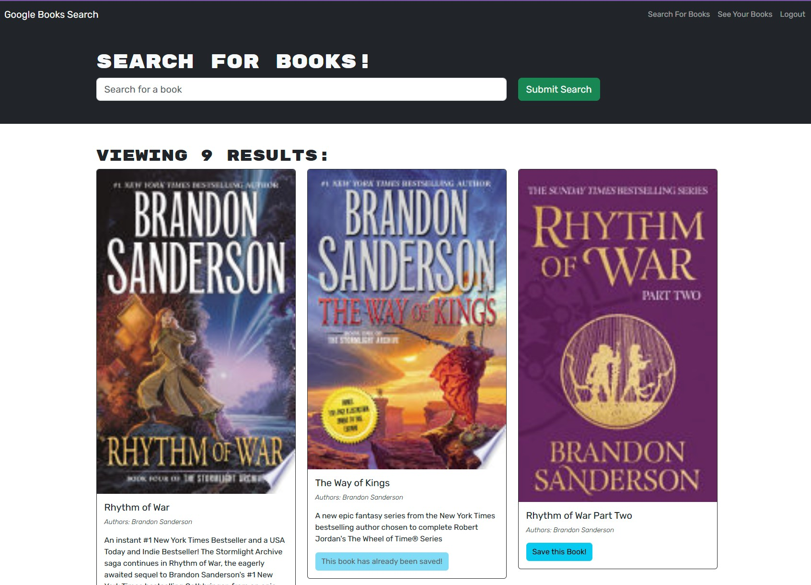
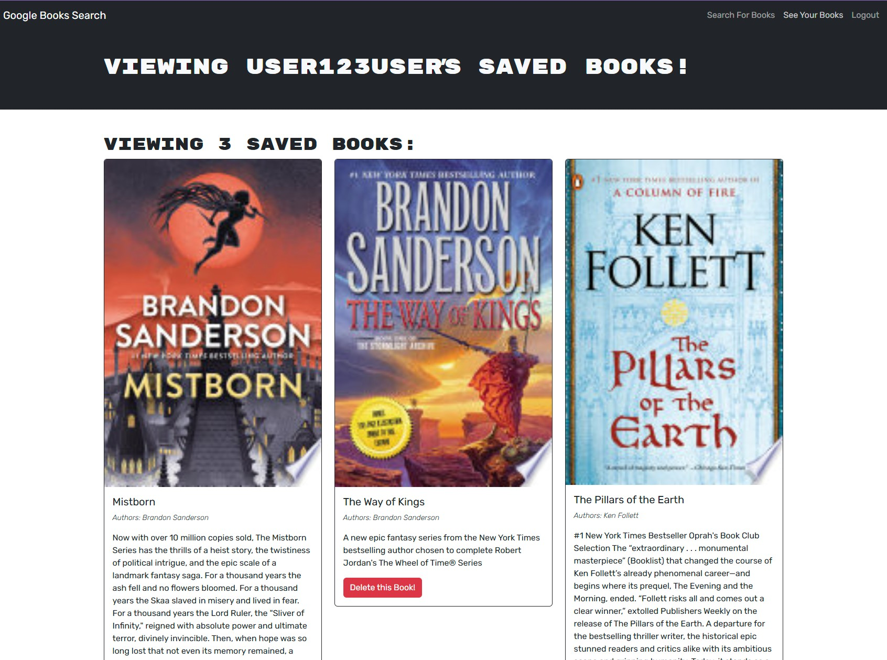

# Book Search Engine (MERN Stack + GraphQL)

## Description

This project is a **Google Books API Search Engine** built using the MERN stack (MongoDB, Express.js, React, Node.js). The original RESTful API implementation was refactored into a **GraphQL API using Apollo Server**. Users can search for books, save favorites, view saved books, and manage collections securely using JWT authentication.

---

## Table of Contents

- [Description](#description)
- [Deployed Application](#deployed-application)
- [Application Screenshot](#application-screenshot)
- [Technologies Used](#technologies-used)
- [User Story](#user-story)
- [Installation](#installation)
- [Deployment (Render & MongoDB Atlas)](#deployment-render--mongodb-atlas)
- [Useful Resources](#useful-resources)
- [Credits](#credits)
- [License](#license)

---

## Deployed Application

[Book Search Engine](https://one8-mern-book-se.onrender.com/)

---

## Application Screenshot





---

## Technologies Used

### Front-end

- React
- Vite
- Apollo Client (GraphQL)
- Tailwind CSS

### Back-end

- Node.js
- Express.js
- Apollo Server (GraphQL)
- MongoDB Atlas
- Mongoose ODM
- JWT Authentication

### Deployment

- Render
- MongoDB Atlas

---

## User Story

AS AN avid reader I WANT to search for new books to read SO THAT I can keep a list of books to purchase

---

## Installation

### Step 1: Clone Repository

```bash
git clone https://github.com/Saosyn/18-MERN-Book-SE.git
cd book-search-engine
```

### Step 2: Install Dependencies

```bash
npm install
```

### Step 3: Configure Environment Variables

Create .env in project root:

MONGODB_URI=your_mongodb_uri
JWT_SECRET_KEY=your_jwt_secret_key

### Step 4: Run Locally

```bash
npm run develop
```

Client: http://localhost:3000
GraphQL: http://localhost:3001/graphql

---

## Useful Resources

- [Apollo Server Documentation](https://www.apollographql.com/docs/apollo-server/)
- [MongoDB Atlas Guide](https://www.mongodb.com/cloud/atlas)
- [Render Deployment Docs](https://render.com/docs)

---

## Credits

-Starter code provided by Columbia/edX Bootcamp

---

## License

-Licensed under the MIT License. See LICENSE file for details.
